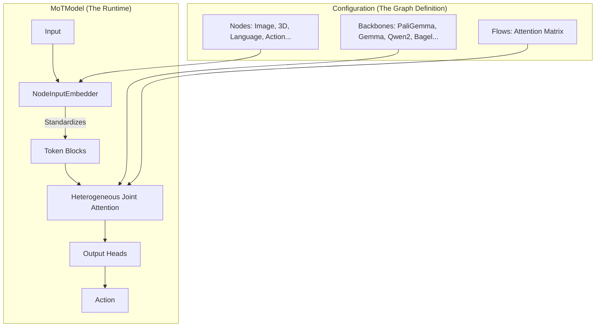

# MoT (Mixture of Transformers) Policy

**A Graph-Driven, Heterogeneous Multi-Transformer Framework for Robot Learning.**

The MoT (Mixture of Transformers) policy is a highly configurable architecture designed to enable flexible attention patterns between different modalities (Vision, Language, Action, State) processed by different Transformer backbones.

It is designed to seamlessly reproduce architectures like **pi0** (Physical Intelligence) while offering the flexibility to construct arbitrary multi-model topologies via configuration files.

---

## 🌟 Key Features

- **Graph-Driven Architecture**: Define your robot's "brain" as a graph of **Nodes** (Inputs/Outputs) and **Flows** (Attention).
- **Heterogeneous Joint Attention**: The core innovation. It allows different backbones with **different hidden sizes** (e.g., PaliGemma 2048-dim + Gemma 1024-dim) to perform joint attention in a unified head space.
- **Modular Input Embedding**: A generalized `NodeInputEmbedder` system that handles standardizing inputs (Vision, Text, State, Time-Fused Actions) into tokens automatically.
- **Swappable Backbones**: Mix and match any Transformer (PaliGemma, Gemma, LLaMA, Qwen, etc.) within a single policy.
- **Multiple Decoding Modes**:
  - 🌊 **Flow Matching** (pi0, pi0.5): Continuous action generation via ODE integration.
  - 📝 **Autoregressive** (pi0FAST): Discrete action token generation.

---

## 🧩 Architecture Overview

The MoT framework treats the model as a graph defined by three core abstractions:



### 1. Nodes (The "Organs")

Nodes represent data modalities or processing stages.

- **`vlm`**: Handles images and text.
- **`action_expert`**: Handles proprioception and generates actions.
- Each node has a flexible `NodeInputConfig` to define how raw data becomes tokens (e.g., Time-MLP fusion for Flow Matching).

### 2. Flows (The "Nervous System")

Flows define "who attends to whom".

- **Full**: Bidirectional visibility (e.g., Image Patches).
- **Causal**: Unidirectional visibility (e.g., Action Generation).
- **Prefix**: Mixed mode (Bidirectional Prefix + Causal Suffix), essential for VLA models.

### 3. Backbones (The "Brains")

The actual Transformer weights. MoT supports mapping multiple Nodes to a single Backbone, or distinct Backbones for different Nodes.

---

## 🧠 Heterogeneous Joint Layer Attention

MoT implements **explicit heterogeneous joint attention**. This allows models with different widths to "think" together without parameter tying.

**How it works:**
Even if Backbone A is 2048-wide and Backbone B is 1024-wide, they can communicate if they share the same **Head Space** structure (e.g., 8 heads × 256 dim = 2048).

```text
┌─────────────────────────────────────────────────────────────────────────────┐
│                    HETEROGENEOUS JOINT LAYER ATTENTION                      │
├─────────────────────────────────────────────────────────────────────────────┤
│                                                                             │
│  Backbone A (dim=2048)           Backbone B (dim=1024)                      │
│  ┌─────────────────────┐         ┌─────────────────────┐                    │
│  │  LayerNorm + Cond   │         │  LayerNorm + Cond   │                    │
│  └─────────┬───────────┘         └─────────┬───────────┘                    │
│            ↓ Proj A                        ↓ Proj B                         │
│  ┌─────────────────────┐         ┌─────────────────────┐                    │
│  │ 2048 → 8×256 (Head) │         │ 1024 → 8×256 (Head) │                    │
│  └─────────┬───────────┘         └─────────┬───────────┘                    │
│            ↓                               ↓                                │
│            └───────────────┬───────────────┘                                │
│                            ↓                                                │
│            ┌───────────────────────────────┐                                │
│            │   CONCATENATE IN HEAD SPACE   │                                │
│            │   Global RoPE + Attention     │                                │
│            │   (Masking defined by Flows)  │                                │
│            └───────────────┬───────────────┘                                │
│                            ↓                                                │
│            ┌───────────────┴───────────────┐                                │
│            ↓ Split                         ↓ Split                          │
│  ┌─────────────────────┐         ┌─────────────────────┐                    │
│  │ O-Proj A:           │         │ O-Proj B:           │                    │
│  │ 8×256 → 2048        │         │ 8×256 → 1024        │                    │
│  └─────────┬───────────┘         └─────────┬───────────┘                    │
│            ↓                               ↓                                │
│    Independent FFN A               Independent FFN B                        │
└─────────────────────────────────────────────────────────────────────────────┘

```

---

## 🚀 Quick Start

### 1. Using Standard Presets (pi0 / pi0.5)

The easiest way to get started is using the factory functions that replicate state-of-the-art VLA architectures.

```python
from lerobot.policies.mot import MoTPolicy, make_pi0_config

# Create a pi0-like configuration (PaliGemma-2B + Gemma-300M, Flow Matching)
config = make_pi0_config(
    chunk_size=50,
    image_resolution=(224, 224)
)

policy = MoTPolicy(config)

```

### 2. Custom Graph Configuration

You can define a completely custom robot brain by wiring nodes together.

```python
from lerobot.policies.mot import (
    MoTConfig, MoTNodeConfig, MoTFlowConfig, MoTBackboneConfig, MoTPolicy,
    NodeType, AttentionType, BackboneType, DecodingMode
)

# 1. Define Backbones (Compute Units)
backbones = [
    MoTBackboneConfig(name="vision_brain", backbone_type="paligemma", hidden_size=2048),
    MoTBackboneConfig(name="control_brain", backbone_type="gemma", hidden_size=1024),
]

# 2. Define Nodes (I/O Modalities)
nodes = [
    # Vision Node: Inputs images, processed by 'vision_brain'
    MoTNodeConfig(
        name="eye",
        node_type=NodeType.VLM,
        backbone_name="vision_brain",
        input_dim=2048,
        is_input=True
    ),
    # Action Node: Inputs state, outputs action, processed by 'control_brain'
    MoTNodeConfig(
        name="hand",
        node_type=NodeType.ACTION,
        backbone_name="control_brain",
        input_dim=1024,
        is_output=True,
        output_dim=14 # Joint positions
    )
]

# 3. Define Flows (Wiring)
flows = [
    # The hand should see what the eye sees (Cross Attention)
    MoTFlowConfig(source="eye", target="hand", attention_type=AttentionType.FULL),
    # The hand needs to know its own past (Causal Self-Attention)
    MoTFlowConfig(source="hand", target="hand", attention_type=AttentionType.CAUSAL),
    # The eye just looks at the world (Bidirectional Self-Attention)
    MoTFlowConfig(source="eye", target="eye", attention_type=AttentionType.FULL),
]

# 4. Assemble
config = MoTConfig(nodes=nodes, flows=flows, backbones=backbones)
policy = MoTPolicy(config)

```

---

## 📂 Code Structure

- `configuration_mot.py`: Defines the Graph DSL (`MoTNodeConfig`, `MoTFlowConfig`, etc.) and presets.
- `modeling_mot.py`: The core runtime.
- `MoTPolicy`: Main entry point.
- `MoTModel`: Manages the graph execution loop.
- `NodeInputEmbedder`: Standardizes diverse inputs into tokens.
- `MoTJointLayerAttention`: The math engine for heterogeneous attention.

- `processor_mot.py`: Handles data preprocessing (resizing, tokenization) and postprocessing.

---

## 🏋️ Training

Train MoT using the standard LeRobot training script.

```bash
# Train a pi0 equivalent on PushT dataset
python lerobot/scripts/train.py \
    --policy.type=mot \
    --policy.decoding_mode=flow_matching \
    --dataset.repo_id=lerobot/pusht \
    --batch_size=16 \
    --device=cuda

```

## ⚠️ Requirements

- `transformers>=4.40.0`: Required for PaliGemma/Gemma support.
- `torch>=2.2.0`: Recommended for optimal Flow Matching performance (torch.compile).

## Citation

If you use MoT in your research, please cite:

```bibtex
@misc{mot2026,
  title={MoT: Mixture of Transformers for Flexible Multi-Modal Robot Learning},
  year={2026},
  publisher={LeRobot},
}

```
